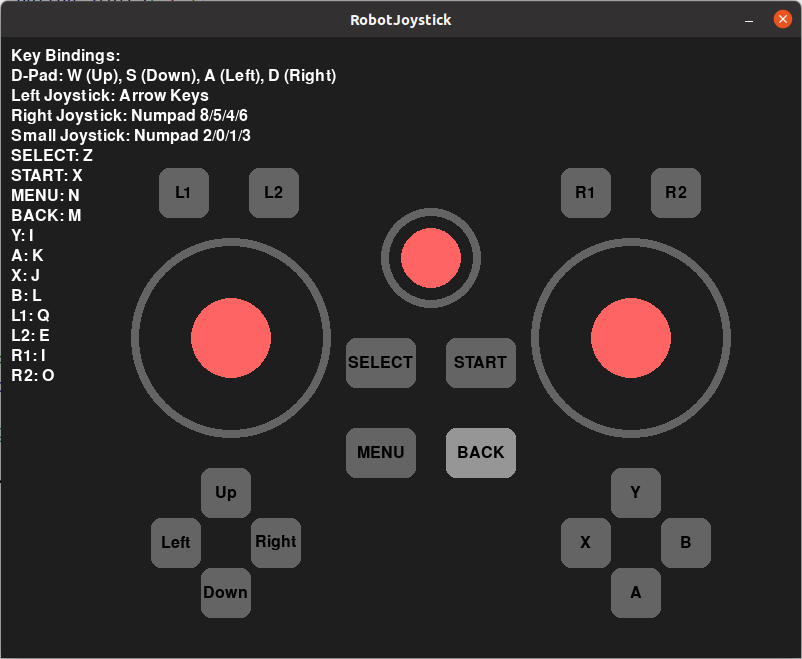

# robot-joystick

## 1. 下载运行

- 打开一个 Bash 终端。

- 下载 robot-joystick：

  ```
  git clone https://github.com/limxdynamics/robot-joystick.git
  ```

- 运行 robot-joystick：

  ```
  ./robot-joystick/robot-joystick
  ```

## 2. 效果展示

